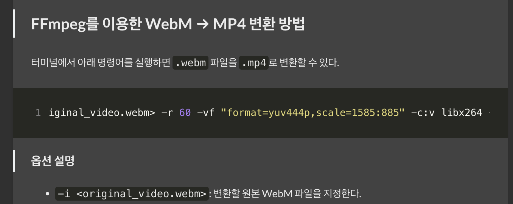
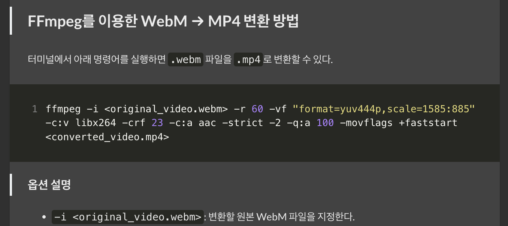

Hugo 블로그의 Stack 테마를 사용할 때, 기본적으로 코드 블록이 wrapping되지 않는 문제가 있었다.



테마 설정에서 해당 옵션에서 찾으려고 했지만 해결하지 못했다. 결국 아래와 같이 CSS를 수정하는 방식으로 문제를 해결했다.

Hugo Stack 테마에서 코드 블록의 wrapping을 활성화하기 위해서는 CSS를 수정해야 한다. `custom.scss` 파일에 다음과 같은 스타일을 추가하는 것이 필요하다.

```scss
// Code Black Wrapping
.article-content {
    pre {
        code {
            white-space: pre-wrap !important;
            word-wrap: break-word !important;
        }
    }
}
```

1. `white-space: pre-wrap`: 코드 블록 내의 텍스트가 컨테이너 너비를 초과할 때 자동으로 줄바꿈
2. `word-wrap: break-word`: 긴 단어나 문자열이 컨테이너 너비를 초과할 때 강제로 줄바꿈
3. `!important` 규칙을 사용하여 테마의 기본 스타일을 덮어씀

변경사항을 적용한 후 Hugo 서버를 재시작하면 코드 블록의 내용이 자동으로 줄바꿈되는 것을 확인할 수 있다.



> 추가로, `custom.scss` 파일에 대해 설명하자면, SCSS 파일은 단순한 CSS 파일이 아니며 CSS를 더 효율적으로 작성할 수 있도록 도와주는 전처리(preprocessor) 언어다. SCSS는 일반 CSS 문법에 변수, 중첩, 믹스인, 함수 등의 기능을 추가해 보다 체계적이고 유지보수가 쉬운 스타일 시트를 작성할 수 있게 한다. 최종적으로 이 SCSS 파일은 표준 CSS로 컴파일되어 웹 브라우저가 인식할 수 있는 형태가 된다.

